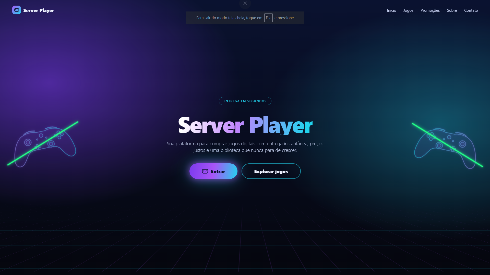

## Integrantes
- (Ruan Nascimento Diniz - @ruandiniz0800-gt1)
- (Carlos Eduardo Almeida Silveira - @CarlosSilveiraDev)
- (Herisson Viana Guedes Júnior - @jotinhajr47-blip)
- (Lucas Pereira Barbosa Santana - @Luc45s)
- (Carlos Matheus Rodrigues Da Silva - @matheus912331)

## Problema e objetivo
O objetivo desse projeto é desenvolver uma plataforma e-commerce de venda de jogos digitais de forma clara e direta para os usuários, sem interfaces poluídas e processos burocráticos.

## Funcionalidades:
- Tela inicial com apresentação da loja
- Login e cadastro
- Páginas de compra e detalhes dos jogos

## Tecnologias
HTML, CSS E JS.

## Como executar
1. Clone o repositório: git clone https://github.com/Feijao-com-arroz/Loja-de-jogos.git
2. Abra a pasta no VS Code.
3. Abra o index.html no navegador (ou use a extensão Live Server).

## Site publicado: https://feijao-com-arroz.github.io/Loja-de-jogos/

## Fluxo Git
Cada funcionalidade nasce em uma branch própria, é enviada por Pull Request,
revisada por outro integrante e depois integrada ao projeto.

## Screenshots

## Organização da equipe
- Backlog: Gerenciamento das ISSUES: https://github.com/Feijao-com-arroz/Loja-de-jogos/issues?q=is%3Aissue+state%3Aclosed

- Quadro Kanban: https://github.com/orgs/Feijao-com-arroz/projects/1

## Estrutura do projeto:
├── index.html          # Tela de login
├── style.css
├── cadastro.html        # Tela de criação de conta
├── cadastro.css
├── home.html            # Catálogo de jogos
├── home.css
├── jogo-gta5.html        # Detalhes de cada jogo
├── jogo-assasinscreed.html
├── jogo-minecraft.html
├── jogo-fifa22.html
├── jogo.css
├── perfil.html           # Perfil do usuário
├── perfil.css
└── img/                  # Imagens do projeto
└── img/                      # Imagens do projeto

